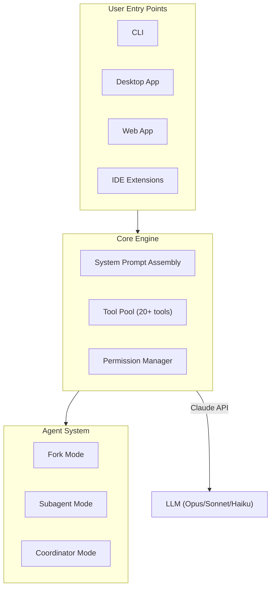

# Claude Code Prompt

[English](#overview) | [中文](README_zh.md)

[](https://opensource.org/licenses/MIT)

> A comprehensive, reverse-engineered documentation of all system prompts, tool prompts, and product architecture for [Claude Code](https://claude.com/claude-code) -- Anthropic's official AI coding assistant.

---

## Overview

This project provides a complete analysis and documentation of Claude Code's prompt engineering system. Every prompt — from core system instructions to individual tool definitions — has been extracted, categorized, and documented with Mermaid architecture diagrams.

**What's inside:**

- Full system prompt breakdown (13 sections)
- All tool prompts (20+ tools)
- Agent & Coordinator multi-worker orchestration system
- Output style system
- Safety & security instructions
- Prompt assembly pipeline & caching mechanism

## Table of Contents

| Document | Description |
|----------|-------------|
| [00-architecture](docs/en/00-architecture.md) | Product architecture overview with 10+ Mermaid diagrams |
| [01-system-prompt](docs/en/01-system-prompt.md) | Core system prompt -- 13 sub-sections covering identity, task guidance, tool usage, etc. |
| [02-tool-prompts-core](docs/en/02-tool-prompts-core.md) | Core file tools: Bash, Read, Write, Edit |
| [03-tool-prompts-search](docs/en/03-tool-prompts-search.md) | Search tools: Glob, Grep, WebSearch, WebFetch |
| [04-tool-prompts-workflow](docs/en/04-tool-prompts-workflow.md) | Workflow tools: PlanMode, Skill, Config, Cron, Worktree, Team, ToolSearch |
| [05-agent-and-coordinator](docs/en/05-agent-and-coordinator.md) | Agent system (Fork/Subagent) & Coordinator multi-worker mode |
| [06-output-styles](docs/en/06-output-styles.md) | Output styles: Default, Explanatory, Learning |
| [07-safety-and-security](docs/en/07-safety-and-security.md) | Cyber risk & safety instructions |
| [08-companion-and-auxiliary](docs/en/08-companion-and-auxiliary.md) | Companion system, Hooks, Language, XML Tags, Memory |
| [09-prompt-assembly](docs/en/09-prompt-assembly.md) | Prompt assembly pipeline, caching boundaries & section registration |

## Architecture at a Glance



## Key Insights

### Prompt Assembly Pipeline

Claude Code's system prompt is assembled from **17 modular sections**, split by a **Dynamic Boundary** marker into:

- **Static sections** (cacheable globally across organizations)
- **Dynamic sections** (session-specific, recomputed per turn)

This design enables efficient prompt caching while maintaining per-session customization.

### Agent Architecture

Claude Code supports three agent modes:

| Mode | Use Case |
|------|----------|
| **Fork** | Inherits parent context, shares prompt cache. Best for research & implementation. |
| **Subagent** | Fresh context with specialized tools. Best for independent verification. |
| **Coordinator** | Orchestrates multiple Workers in parallel. Research → Synthesis → Implementation → Verification. |

### Tool Deferral System

Not all tools are loaded at startup. MCP tools and tools marked `shouldDefer` are **lazily loaded** via `ToolSearch` — only their names appear initially, and full schemas are fetched on demand.

## Use as a Claude Code Skill

This project includes a ready-to-use **Claude Code Skill** (`/claude-code-prompt`) that provides prompt engineering best practices as a reference during AI/Agent development.

### Installation

Copy the skill file to your Claude Code commands directory:

```bash
# Clone the repo
git clone https://github.com/mm7894215/claude-code-prompt.git

# Install the skill globally
cp -r claude-code-prompt/skills/claude-code-prompt ~/.claude/skills/
```

### Usage

In any Claude Code session:

```bash
/claude-code-prompt                      # Full reference overview
/claude-code-prompt --topic=agent        # Agent/multi-worker patterns
/claude-code-prompt --topic=tools        # Tool prompt design patterns
/claude-code-prompt --topic=system       # System prompt architecture
/claude-code-prompt --topic=coordinator  # Multi-worker orchestration
/claude-code-prompt --topic=safety       # Safety instruction patterns
```

### What It Provides

When you're building AI assistants, agent systems, or tool-using LLM applications, this skill gives you:

- **System Prompt Architecture** -- Modular section design, cache boundary patterns, key behavioral principles
- **Tool Prompt Design** -- Routing rules, sandbox patterns, read-before-write invariants, deferred loading
- **Agent Orchestration** -- Fork vs Subagent decisions, prompt writing rules, parallel execution patterns
- **Coordinator Patterns** -- Phase-based workflows, synthesis-first principle, continue vs spawn decisions
- **Safety Design** -- Layered safety architecture, dual-use policies, reversibility framework, prompt injection defense

## Disclaimer

> [!IMPORTANT]
> This project is an **unofficial**, independently created documentation based on publicly available source code analysis. It is not affiliated with, endorsed by, or sponsored by Anthropic.
>
> The content is provided for **educational and research purposes only**. Prompt content may change at any time as Claude Code evolves.

## Contributing

Contributions are welcome! Please see [CONTRIBUTING.md](CONTRIBUTING.md) for guidelines.

If you find inaccuracies or have updates based on newer versions of Claude Code, feel free to open an issue or submit a pull request.

## License

This project is licensed under the [MIT License](LICENSE).

## Star History

If you find this project useful, please consider giving it a star!
