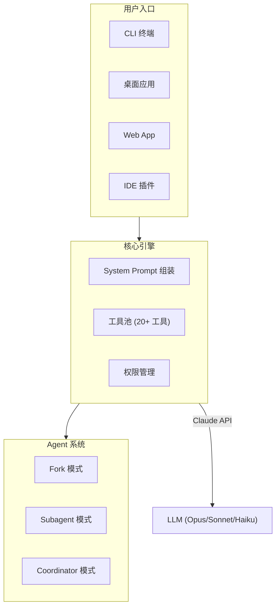

# Claude Code Prompt

[English](README.md) | 中文

> 对 [Claude Code](https://claude.com/claude-code) (Anthropic 官方 AI 编程助手) 的全部系统提示词、工具提示词和产品功能架构进行完整的逆向工程文档化。

---

## 概述

本项目提供了 Claude Code 提示词工程系统的完整分析和文档。从核心系统指令到每个工具的定义，所有 prompt 均已提取、分类，并配以 Mermaid 架构图进行说明。

**包含内容:**

- 完整的系统提示词拆解 (13 个子模块)
- 全部工具提示词 (20+ 个工具)
- Agent 与 Coordinator 多 Worker 编排系统
- 输出风格系统
- 安全指令
- Prompt 组装流程与缓存机制

## 文档导航

| 文档 | 说明 |
|------|------|
| [00-architecture](docs/zh/00-architecture.md) | 产品功能架构全景图，包含 10+ 个 Mermaid 图表 |
| [01-system-prompt](docs/zh/01-system-prompt.md) | 核心系统提示词 - 13 个子 Section (身份定义、任务指导、工具使用等) |
| [02-tool-prompts-core](docs/zh/02-tool-prompts-core.md) | 核心文件工具: Bash, Read, Write, Edit |
| [03-tool-prompts-search](docs/zh/03-tool-prompts-search.md) | 搜索类工具: Glob, Grep, WebSearch, WebFetch |
| [04-tool-prompts-workflow](docs/zh/04-tool-prompts-workflow.md) | 工作流工具: PlanMode, Skill, Config, Cron, Worktree, Team, ToolSearch |
| [05-agent-and-coordinator](docs/zh/05-agent-and-coordinator.md) | Agent 系统 (Fork/Subagent 双模式) 与 Coordinator 多 Worker 协调模式 |
| [06-output-styles](docs/zh/06-output-styles.md) | 输出风格: Default, Explanatory, Learning 模式 |
| [07-safety-and-security](docs/zh/07-safety-and-security.md) | 安全指令与 Cyber Risk 边界 |
| [08-companion-and-auxiliary](docs/zh/08-companion-and-auxiliary.md) | Companion 伴侣系统、Hooks、Language、XML Tags、Memory |
| [09-prompt-assembly](docs/zh/09-prompt-assembly.md) | Prompt 组装流程、缓存边界、动态 Section 注册机制 |

## 架构概览

## 核心发现

### Prompt 组装流水线

Claude Code 的系统提示词由 **17 个模块化 Section** 组装而成，通过 **Dynamic Boundary 标记** 分为:

- **静态 Section** (可跨组织全局缓存)
- **动态 Section** (会话级别，每轮重算)

这种设计在保持按需定制的同时，实现了高效的 prompt 缓存复用。

### Agent 架构

Claude Code 支持三种 Agent 模式:

| 模式 | 使用场景 |
|------|---------|
| **Fork** | 继承父级上下文，共享 prompt cache。适合: 研究、多步实现 |
| **Subagent** | 独立空白上下文，专用工具集。适合: 独立验证、专项任务 |
| **Coordinator** | 编排多个 Worker 并行工作。流程: 研究 -> 综合分析 -> 实现 -> 验证 |

### 工具延迟加载机制

并非所有工具在启动时加载。MCP 工具和标记为 `shouldDefer` 的工具通过 `ToolSearch` **按需加载** -- 启动时只显示工具名称，使用时才获取完整 schema。

## 免责声明

> [!IMPORTANT]
> 本项目是基于公开可获取的源码分析所创建的**非官方**独立文档。与 Anthropic 无任何关联、背书或赞助关系。
>
> 内容仅供**学习和研究**使用。随着 Claude Code 的迭代更新，Prompt 内容可能随时变化。

## 贡献

欢迎贡献! 请阅读 [CONTRIBUTING.md](CONTRIBUTING.md) 了解指南。

如果你发现内容不准确，或者有基于新版本 Claude Code 的更新，欢迎提 Issue 或提交 PR。

## 许可证

本项目基于 [MIT License](LICENSE) 开源。

## Star History

如果觉得有帮助，请给个 Star!
