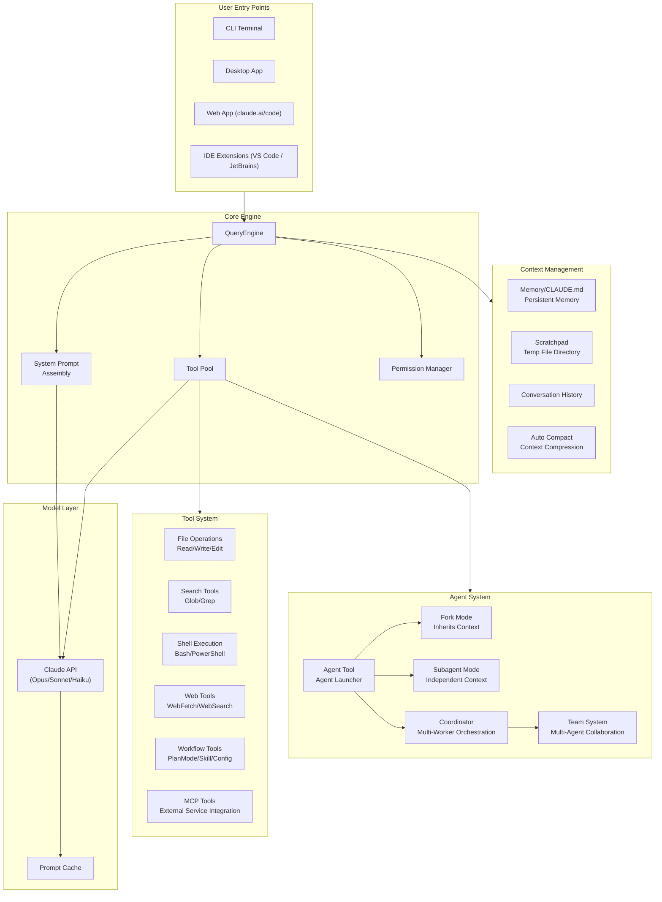
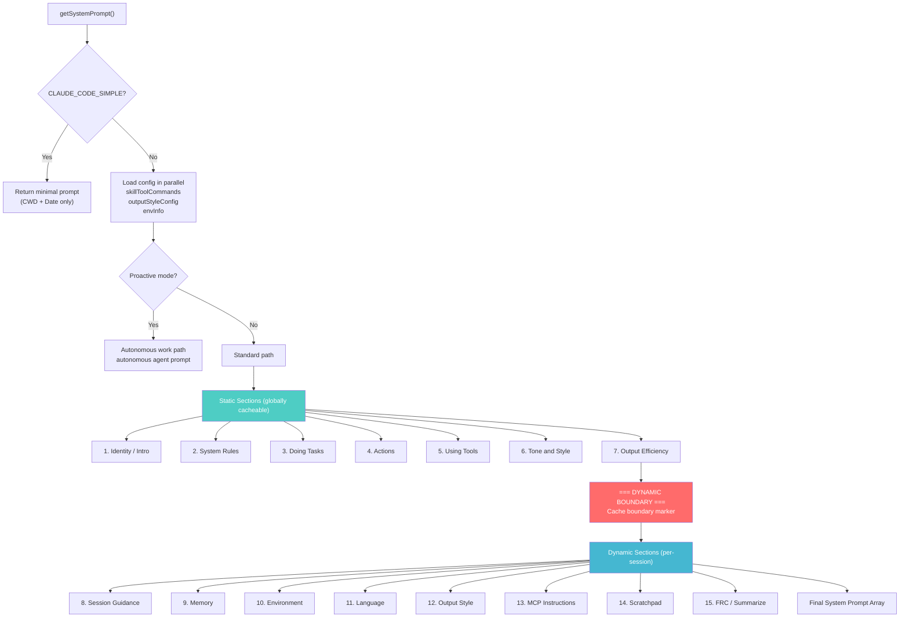
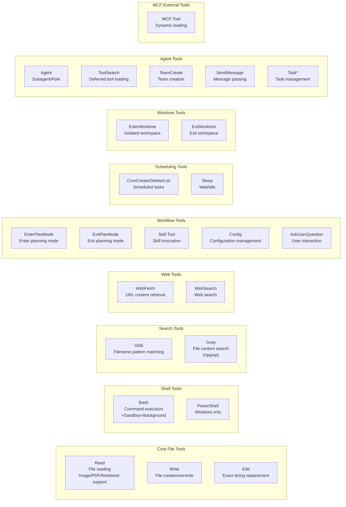
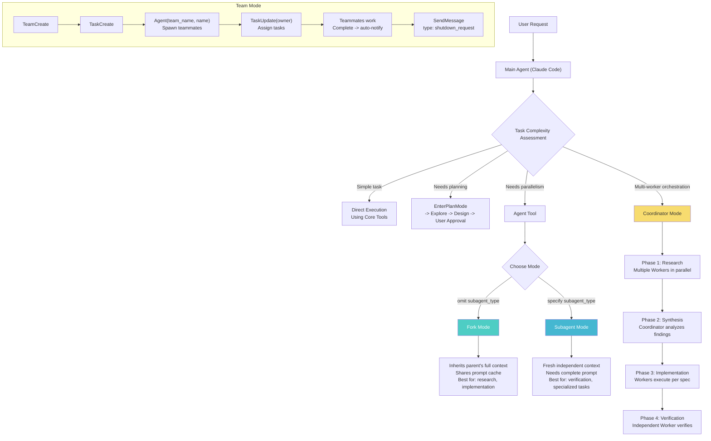
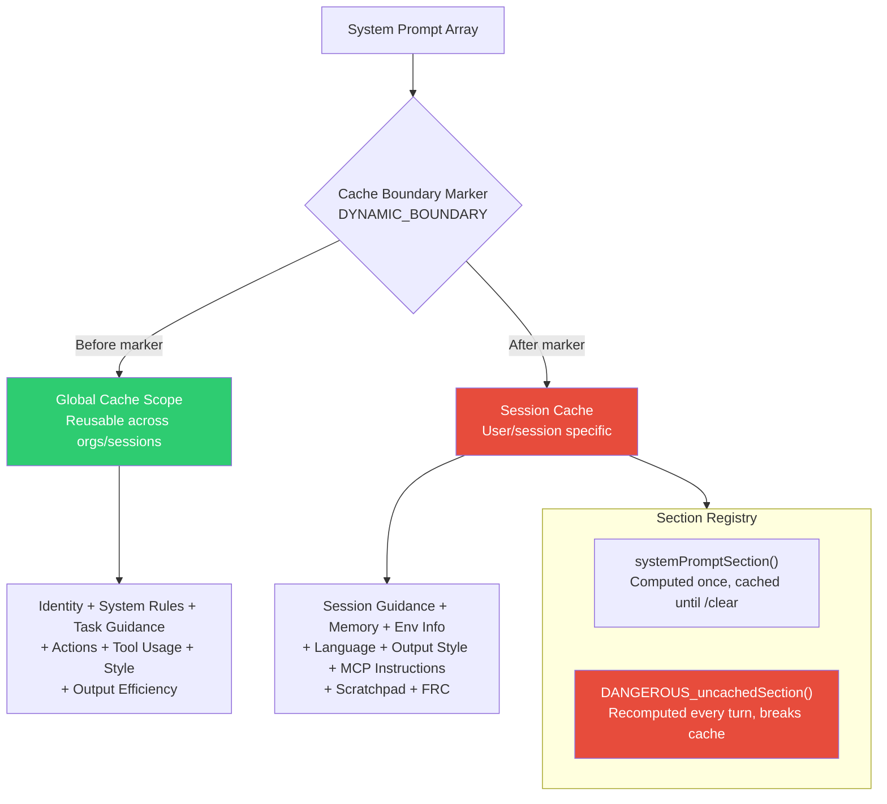
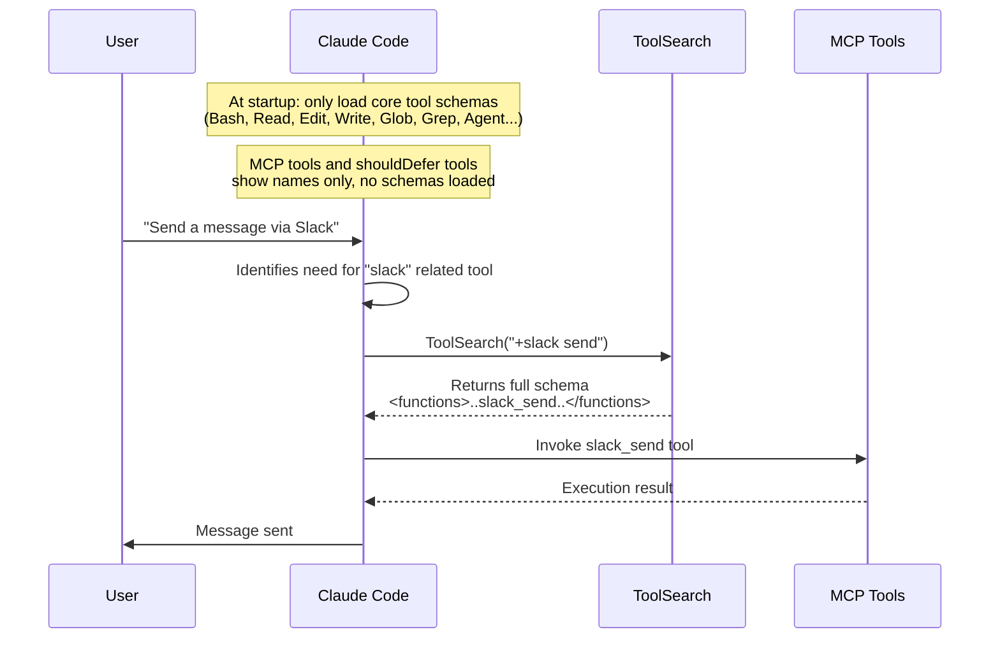
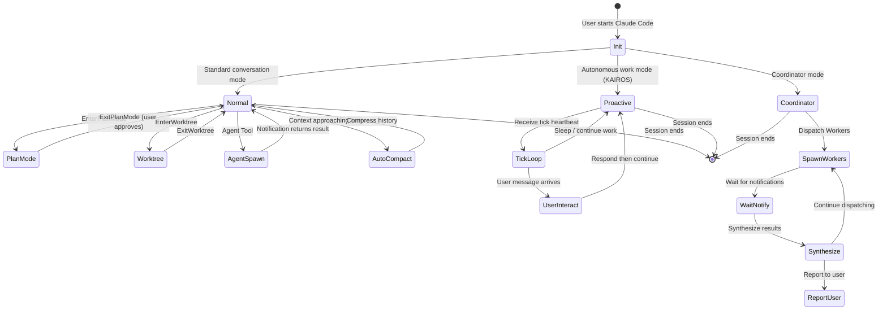
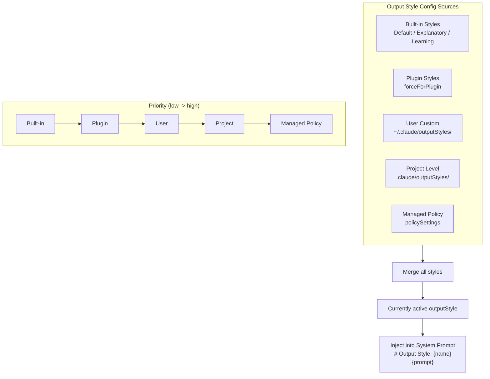
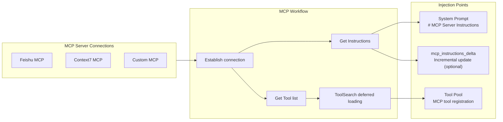

# 00 - Claude Code Product Architecture Overview

> This document uses Mermaid diagrams to illustrate the complete product architecture, module relationships, and data flows of Claude Code.

---

## 1. Overall System Architecture

---

## 2. System Prompt Assembly Flow

---

## 3. Tool System Architecture

---

## 4. Agent System Modes

---

## 5. Permission & Security System

```mermaid
flowchart LR
    subgraph PermModes["Permission Modes"]
        Auto["Auto-approve Mode"]
        Plan2["Plan Mode<br/>Read: auto / Write: approval"]
        Normal["Normal Mode<br/>Approve by type"]
    end

    subgraph Safety["Safety Layer"]
        Cyber["Cyber Risk Instruction<br/>Security boundaries"]
        Sandbox["Bash Sandbox<br/>Filesystem + Network restrictions"]
        Hooks["User Hooks<br/>Event-driven shell commands"]
        Actions["Action Guard<br/>Dangerous action confirmation"]
    end

    subgraph Guardrails["Guardrails"]
        NoURL["No URL guessing"]
        NoDestructive["Destructive ops require confirmation<br/>force push / reset --hard"]
        NoSecrets["No committing secrets<br/>.env / credentials"]
        InjectionCheck["Prompt injection detection<br/>Flag suspicious tool output"]
    end

    PermModes --> Safety
    Safety --> Guardrails
```

---

## 6. Prompt Caching Mechanism

---

## 7. Tool Deferred Loading Mechanism

---

## 8. Conversation Lifecycle

---

## 9. Output Style System

---

## 10. MCP Integration Architecture

