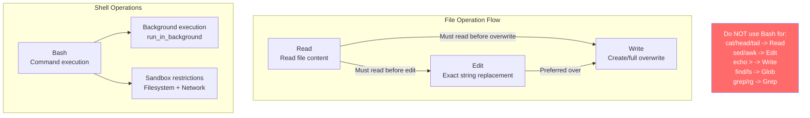

# 02 - Core Tool Prompts (Bash / Read / Write / Edit)

> These 4 tools provide Claude Code's fundamental file operations and command execution capabilities.

---

## Tool Relationships



---

## 1. BashTool

**Source**: `tools/BashTool/prompt.ts` | **Name**: `Bash`

```
Executes a given bash command and returns its output.
Working directory persists between commands; shell state does not.

IMPORTANT: Avoid using this tool to run find, grep, cat, head, tail, sed, awk,
or echo commands. Use the appropriate dedicated tool instead.
```

### Key Instructions
- Verify parent directories exist before creating files
- Always quote file paths with spaces
- Use absolute paths to maintain working directory
- Configurable timeout, run_in_background for async
- Parallel independent commands via multiple tool calls; chain dependent ones with `&&`
- Git: prefer new commits, avoid destructive ops, never skip hooks

### Command Sandbox
```
By default, commands run in a sandbox controlling directory and network access.
Do NOT attempt dangerouslyDisableSandbox: true unless the user explicitly asks
or a command fails with evidence of sandbox-caused failure.
```

### Git Commit / PR Workflow
- Only commit when requested; follow parallel verification steps
- If pre-commit hook fails: fix issue, create NEW commit (never amend)
- For PRs: use `gh` CLI, analyze ALL commits in scope

---

## 2. FileReadTool

**Source**: `tools/FileReadTool/prompt.ts` | **Name**: `Read`

```
Reads a file from the local filesystem.
- file_path must be absolute
- Default: up to 2000 lines from beginning
- Supports images (PNG, JPG), PDFs (with pages parameter), Jupyter notebooks
- Can only read files, not directories
- Returns cat -n format with line numbers starting at 1
```

---

## 3. FileWriteTool

**Source**: `tools/FileWriteTool/prompt.ts` | **Name**: `Write`

```
Writes a file to the local filesystem.
- Overwrites existing files; you MUST use Read tool first for existing files
- Prefer Edit tool for modifications (sends only diff)
- NEVER create *.md or README files unless explicitly requested
```

---

## 4. FileEditTool

**Source**: `tools/FileEditTool/prompt.ts` | **Name**: `Edit`

```
Performs exact string replacements in files.
- Must Read the file at least once before editing
- Preserve exact indentation from file content
- ALWAYS prefer editing existing files over creating new ones
- Edit will FAIL if old_string is not unique — use more context or replace_all
- Use smallest old_string that's clearly unique (usually 2-4 lines)
```
