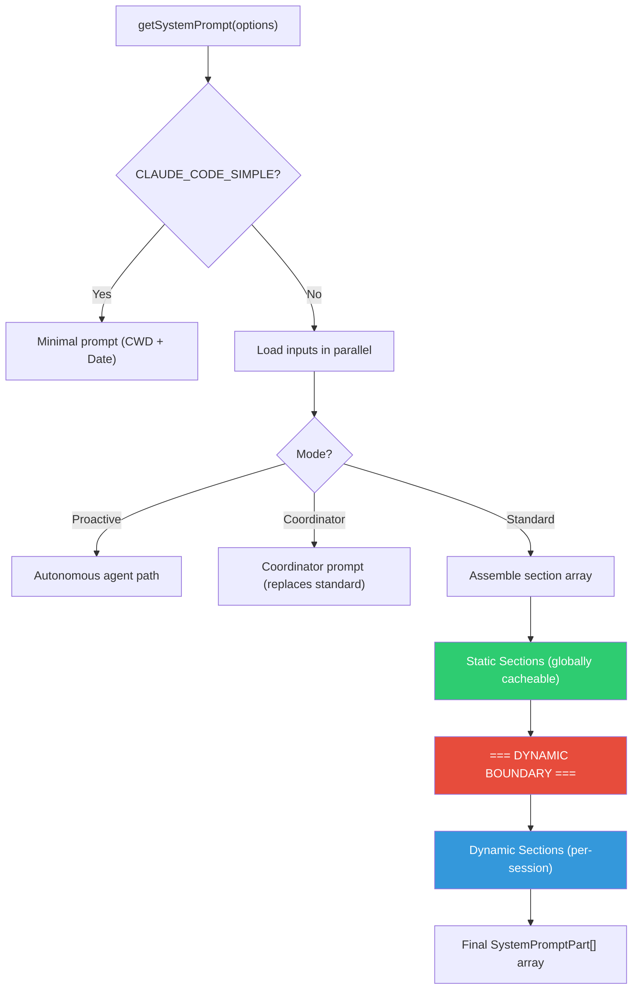

# 09 - Prompt Assembly Pipeline & Caching

> **Source**: `constants/prompts.ts`, `constants/systemPromptSections.ts`
>
> How the System Prompt is assembled, cached, and managed across sessions.

---

## 1. Assembly Overview



---

## 2. Cache Boundary (DYNAMIC BOUNDARY)

Claude API supports Prompt Caching. The system prompt is split into two cache zones:

| Zone | Cache Scope | Content |
|------|-------------|---------|
| **Before marker** | `global` — reusable across orgs/sessions | Identity, rules, task guidance, tool usage, style |
| **After marker** | `session` — current session only | Environment, memory, language, MCP, scratchpad |

Marker: `__SYSTEM_PROMPT_DYNAMIC_BOUNDARY__`

---

## 3. Section Registry

Two section types:

| Type | Behavior | Use Case |
|------|----------|----------|
| `systemPromptSection()` | Computed once, cached until `/clear` | Most sections |
| `DANGEROUS_uncachedSection()` | Recomputed every turn, breaks cache | Real-time data only |

---

## 4. SystemPromptPart Structure

```typescript
interface SystemPromptPart {
  content: string
  scope: 'global' | 'session'
}
```

---

## 5. Full Assembly Order

| # | Section | Function | Scope | Condition |
|---|---------|----------|-------|-----------|
| 1 | Identity / Intro | `getSimpleIntroSection()` | global | Always |
| 2 | System | `getSimpleSystemSection()` | global | Always |
| 3 | Doing Tasks | `getSimpleDoingTasksSection()` | global | Always |
| 4 | Actions | `getActionsSection()` | global | Always |
| 5 | Using Tools | `getUsingYourToolsSection()` | global | Always |
| 6 | Tone and Style | `getSimpleToneAndStyleSection()` | global | Always |
| 7 | Output Efficiency | `getOutputEfficiencySection()` | global | Always |
| -- | **DYNAMIC BOUNDARY** | -- | -- | -- |
| 8 | Session Guidance | `getSessionSpecificGuidanceSection()` | session | Always |
| 9 | Memory | `loadMemoryPrompt()` | session | If CLAUDE.md exists |
| 10 | Ant Model Override | `getAntModelOverrideSection()` | session | If USER_TYPE=ant |
| 11 | Environment | `computeSimpleEnvInfo()` | session | Always |
| 12 | Language | `getLanguageSection()` | session | If language preference set |
| 13 | Output Style | `getOutputStyleSection()` | session | If output style set |
| 14 | MCP Instructions | `getMcpInstructionsSection()` | session | If MCP servers connected |
| 15 | Scratchpad | `getScratchpadInstructions()` | session | If feature enabled |
| 16 | Function Result Clearing | `getFunctionResultClearingSection()` | session | Always |
| 17 | Summarize Tool Results | `SUMMARIZE_TOOL_RESULTS_SECTION` | session | If feature enabled |
