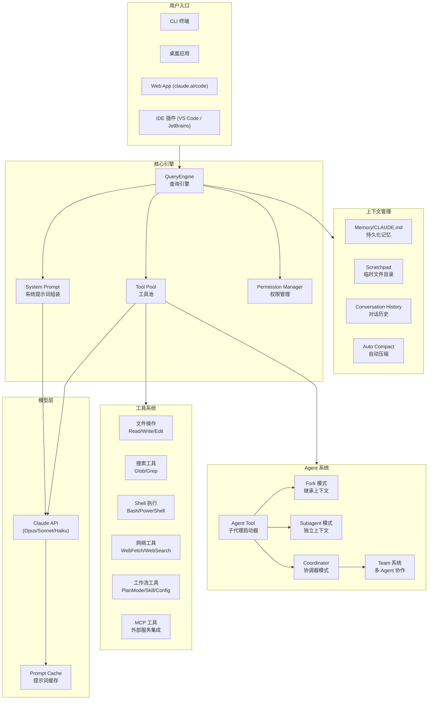
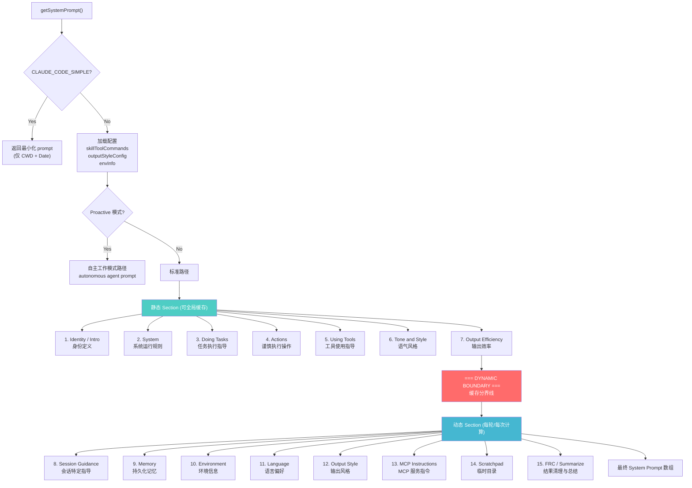
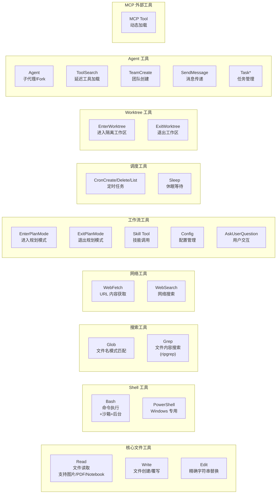
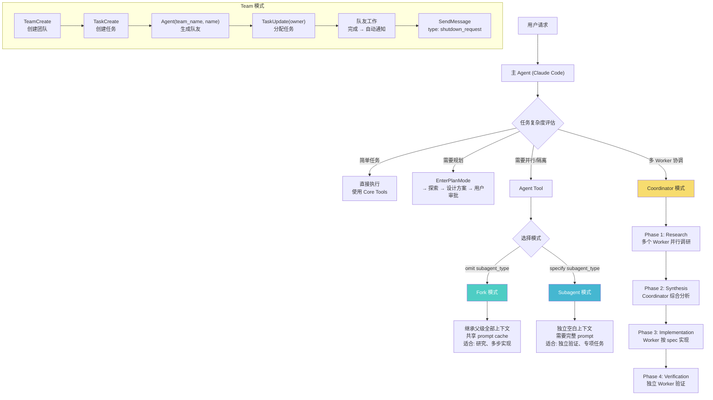
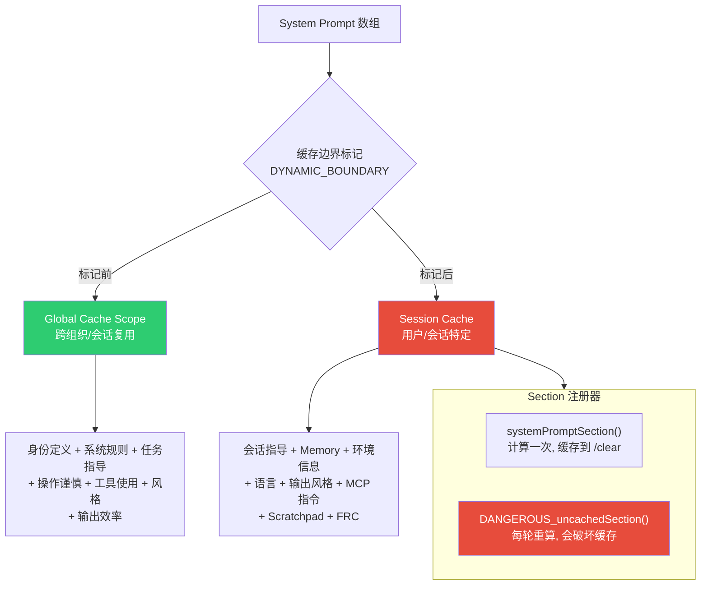
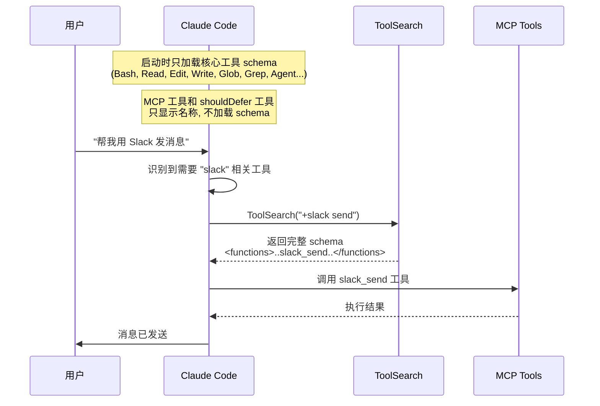
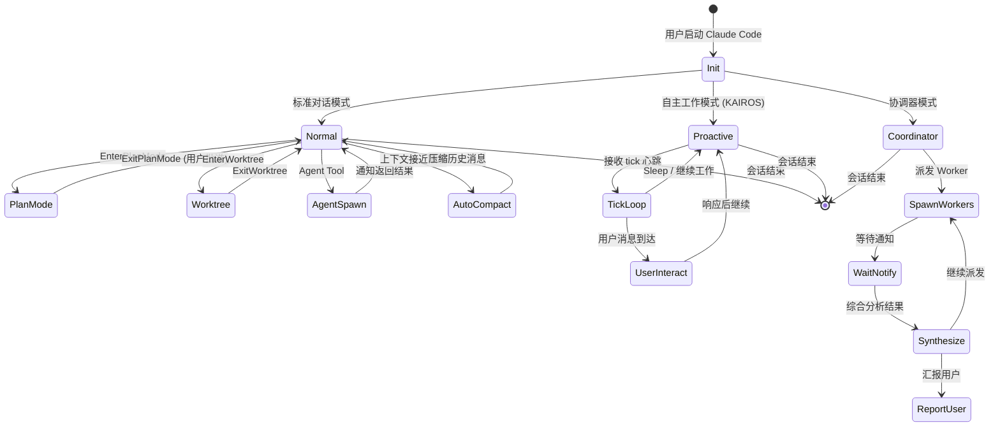
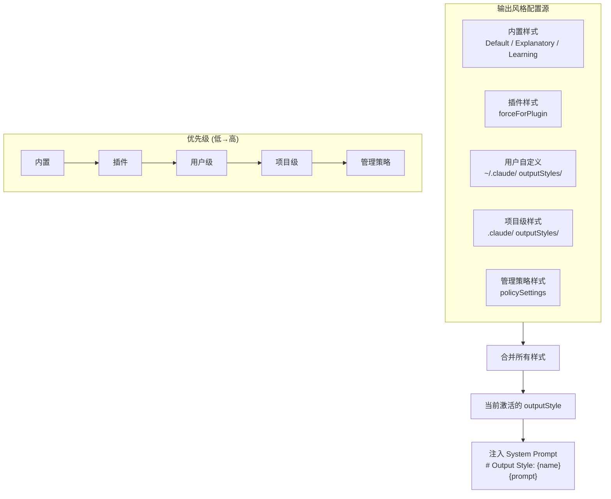
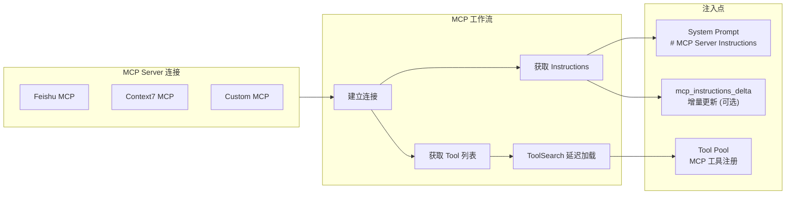

# 00 - Claude Code 产品功能架构全景图

> 本文档使用 Mermaid 图表展示 Claude Code 的完整产品架构、模块关系和数据流。

---

## 1. 系统总体架构

---

## 2. System Prompt 组装流程

---

## 3. 工具系统架构

---

## 4. Agent 系统工作模式

---

## 5. 权限与安全体系

```mermaid
flowchart LR
    subgraph PermModes["权限模式"]
        Auto["自动批准模式"]
        Plan2["Plan 模式<br/>读取自动/写入需批准"]
        Normal["Normal 模式<br/>按类型审批"]
    end

    subgraph Safety["安全层"]
        Cyber["Cyber Risk Instruction<br/>安全操作边界"]
        Sandbox["Bash Sandbox<br/>文件系统+网络限制"]
        Hooks["User Hooks<br/>事件钩子"]
        Actions["Action Guard<br/>危险操作确认"]
    end

    subgraph Guardrails["护栏规则"]
        NoURL["禁止猜测 URL"]
        NoDestructive["危险操作需确认<br/>force push / reset --hard"]
        NoSecrets["不提交敏感文件<br/>.env / credentials"]
        InjectionCheck["Prompt 注入检测<br/>标记可疑工具输出"]
    end

    PermModes --> Safety
    Safety --> Guardrails
```

---

## 6. Prompt 缓存机制

---

## 7. 工具延迟加载机制

---

## 8. 对话生命周期

---

## 9. 输出风格系统

---

## 10. MCP 集成架构

