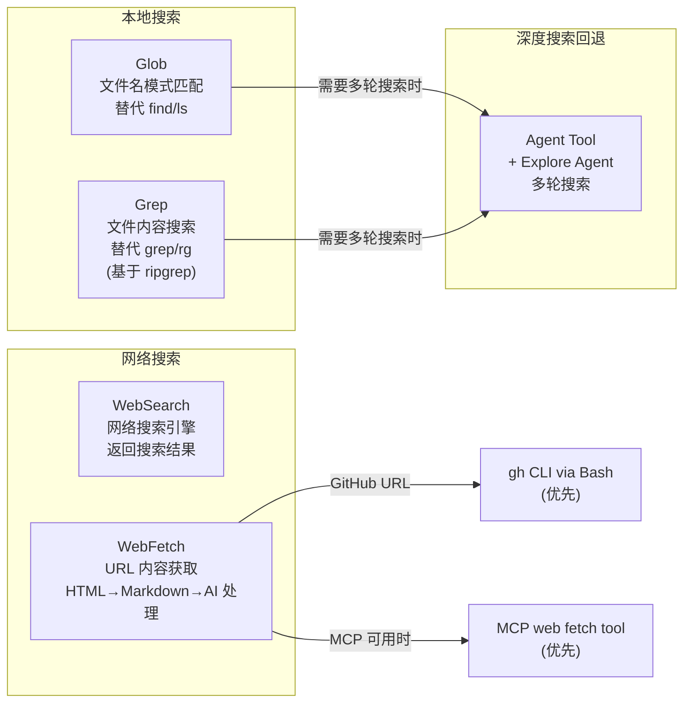

# 03 - 搜索类工具 Prompt (Glob / Grep / WebSearch / WebFetch)

> 这 4 个工具覆盖了本地文件搜索和网络内容获取的能力。

---

## 工具关系图



---

## 1. GlobTool (文件名搜索)

**源文件**: `tools/GlobTool/prompt.ts`
**工具名**: `Glob`

```
- Fast file pattern matching tool that works with any codebase size
- Supports glob patterns like "**/*.js" or "src/**/*.ts"
- Returns matching file paths sorted by modification time
- Use this tool when you need to find files by name patterns
- When you are doing an open ended search that may require multiple rounds of
  globbing and grepping, use the Agent tool instead
```

---

## 2. GrepTool (文件内容搜索)

**源文件**: `tools/GrepTool/prompt.ts`
**工具名**: `Grep`

```
A powerful search tool built on ripgrep

  Usage:
  - ALWAYS use Grep for search tasks. NEVER invoke `grep` or `rg` as a Bash command.
    The Grep tool has been optimized for correct permissions and access.
  - Supports full regex syntax (e.g., "log.*Error", "function\\s+\\w+")
  - Filter files with glob parameter (e.g., "*.js", "**/*.tsx") or type parameter
    (e.g., "js", "py", "rust")
  - Output modes:
    - "content" shows matching lines
    - "files_with_matches" shows only file paths (default)
    - "count" shows match counts
  - Use Agent tool for open-ended searches requiring multiple rounds
  - Pattern syntax: Uses ripgrep (not grep) — literal braces need escaping
    (use `interface\\{\\}` to find `interface{}` in Go code)
  - Multiline matching: By default patterns match within single lines only.
    For cross-line patterns like `struct \\{[\\s\\S]*?field`, use `multiline: true`
```

---

## 3. WebSearchTool (网络搜索)

**源文件**: `tools/WebSearchTool/prompt.ts`
**工具名**: `WebSearch`

```
- Allows Claude to search the web and use the results to inform responses
- Provides up-to-date information for current events and recent data
- Returns search result information formatted as search result blocks,
  including links as markdown hyperlinks
- Use this tool for accessing information beyond Claude's knowledge cutoff
- Searches are performed automatically within a single API call

CRITICAL REQUIREMENT - You MUST follow this:
  - After answering the user's question, you MUST include a "Sources:" section
    at the end of your response
  - In the Sources section, list all relevant URLs from the search results as
    markdown hyperlinks: [Title](URL)
  - This is MANDATORY - never skip including sources in your response
  - Example format:

    [Your answer here]

    Sources:
    - [Source Title 1](https://example.com/1)
    - [Source Title 2](https://example.com/2)

Usage notes:
  - Domain filtering is supported to include or block specific websites
  - Web search is only available in the US

IMPORTANT - Use the correct year in search queries:
  - The current month is {currentMonthYear}. You MUST use this year when
    searching for recent information, documentation, or current events.
  - Example: If the user asks for "latest React docs", search for
    "React documentation" with the current year, NOT last year
```

---

## 4. WebFetchTool (URL 内容获取)

**源文件**: `tools/WebFetchTool/prompt.ts`
**工具名**: `WebFetch`

### 4.1 工具描述

```
- Fetches content from a specified URL and processes it using an AI model
- Takes a URL and a prompt as input
- Fetches the URL content, converts HTML to markdown
- Processes the content with the prompt using a small, fast model
- Returns the model's response about the content
- Use this tool when you need to retrieve and analyze web content

Usage notes:
  - IMPORTANT: If an MCP-provided web fetch tool is available, prefer using
    that tool instead of this one, as it may have fewer restrictions.
  - The URL must be a fully-formed valid URL
  - HTTP URLs will be automatically upgraded to HTTPS
  - The prompt should describe what information you want to extract from the page
  - This tool is read-only and does not modify any files
  - Results may be summarized if the content is very large
  - Includes a self-cleaning 15-minute cache for faster responses
  - When a URL redirects to a different host, the tool will inform you and provide
    the redirect URL. You should then make a new WebFetch request with the redirect URL.
  - For GitHub URLs, prefer using the gh CLI via Bash instead.
```

### 4.2 Secondary Model Prompt (二次处理提示)

对于预批准域名:
```
Provide a concise response based on the content above. Include relevant details,
code examples, and documentation excerpts as needed.
```

对于其他域名:
```
Provide a concise response based only on the content above. In your response:
- Enforce a strict 125-character maximum for quotes from any source document.
- Use quotation marks for exact language from articles.
- You are not a lawyer and never comment on the legality.
- Never produce or reproduce exact song lyrics.
```
