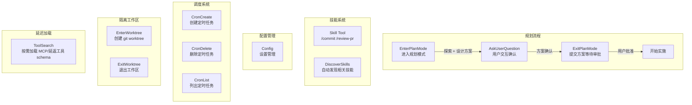

# 04 - 工作流工具 Prompt (PlanMode / Skill / Config / Cron / Worktree / Team / Ask / ToolSearch)

> 这些工具支撑了 Claude Code 的高级工作流: 规划、技能调用、配置、定时任务、隔离工作区、团队协作等。

---

## 工具关系图



---

## 1. EnterPlanModeTool (进入规划模式)

**源文件**: `tools/EnterPlanModeTool/prompt.ts`
**工具名**: `EnterPlanMode`

```
Use this tool proactively when you're about to start a non-trivial implementation
task. Getting user sign-off on your approach before writing code prevents wasted
effort and ensures alignment.

## When to Use This Tool

Prefer using EnterPlanMode for implementation tasks unless they're simple:

1. **New Feature Implementation**: Adding meaningful new functionality
   - Example: "Add a logout button" — where should it go? What should happen on click?

2. **Multiple Valid Approaches**: The task can be solved in several different ways
   - Example: "Add caching to the API" — Redis vs in-memory vs file-based

3. **Code Modifications**: Changes that affect existing behavior or structure
   - Example: "Update the login flow" — what exactly should change?

4. **Architectural Decisions**: Choosing between patterns or technologies
   - Example: "Add real-time updates" — WebSockets vs SSE vs polling

5. **Multi-File Changes**: The task will likely touch more than 2-3 files

6. **Unclear Requirements**: You need to explore before understanding scope

7. **User Preferences Matter**: Implementation could go multiple ways
   - If you would use AskUserQuestion to clarify, use EnterPlanMode instead

## When NOT to Use

- Single-line or few-line fixes (typos, obvious bugs, small tweaks)
- Adding a single function with clear requirements
- Very specific, detailed user instructions
- Pure research/exploration tasks (use Agent tool instead)

## What Happens in Plan Mode
1. Explore the codebase using Glob, Grep, and Read tools
2. Understand existing patterns and architecture
3. Design an implementation approach
4. Present your plan to the user for approval
5. Use AskUserQuestion if you need to clarify approaches
6. Exit plan mode with ExitPlanMode when ready to implement
```

---

## 2. ExitPlanModeTool (退出规划模式)

**源文件**: `tools/ExitPlanModeTool/prompt.ts`
**工具名**: `ExitPlanMode`

```
Use this tool when you are in plan mode and have finished writing your plan to
the plan file and are ready for user approval.

## How This Tool Works
- You should have already written your plan to the plan file
- This tool does NOT take the plan content as a parameter
- This tool simply signals that you're done planning and ready for review
- The user will see the contents of your plan file when they review it

## When to Use
IMPORTANT: Only use when the task requires planning steps that require writing code.
For research tasks (gathering information, searching files, reading files) — do NOT
use this tool.

## Before Using
Ensure your plan is complete and unambiguous:
- If you have unresolved questions, use AskUserQuestion first
- Once your plan is finalized, use THIS tool to request approval

**Important:** Do NOT use AskUserQuestion to ask "Is this plan okay?" or
"Should I proceed?" — that's exactly what THIS tool does.
```

---

## 3. AskUserQuestionTool (用户提问)

**源文件**: `tools/AskUserQuestionTool/prompt.ts`
**工具名**: `AskUserQuestion`

```
Use this tool when you need to ask the user questions during execution:
1. Gather user preferences or requirements
2. Clarify ambiguous instructions
3. Get decisions on implementation choices as you work
4. Offer choices to the user about what direction to take

Usage notes:
- Users will always be able to select "Other" to provide custom text input
- Use multiSelect: true to allow multiple answers to be selected
- If you recommend a specific option, make that the first option in the list
  and add "(Recommended)" at the end of the label

Plan mode note: In plan mode, use this tool to clarify requirements or choose
between approaches BEFORE finalizing your plan. Do NOT use this tool to ask
"Is my plan ready?" or "Should I proceed?" — use ExitPlanMode for plan approval.
IMPORTANT: Do not reference "the plan" in your questions because the user cannot
see the plan until you call ExitPlanMode.
```

**Preview 功能**:
```
Preview feature:
Use the optional `preview` field on options when presenting concrete artifacts:
- ASCII mockups of UI layouts or components
- Code snippets showing different implementations
- Diagram variations
- Configuration examples

Preview content is rendered as markdown in a monospace box. Multi-line text with
newlines is supported. Note: previews are only supported for single-select questions.
```

---

## 4. SkillTool (技能工具)

**源文件**: `tools/SkillTool/prompt.ts`
**工具名**: `Skill`

```
Execute a skill within the main conversation

When users ask you to perform tasks, check if any of the available skills match.
Skills provide specialized capabilities and domain knowledge.

When users reference a "slash command" or "/<something>" (e.g., "/commit", "/review-pr"),
they are referring to a skill. Use this tool to invoke it.

How to invoke:
- Use this tool with the skill name and optional arguments
- Examples:
  - `skill: "pdf"` — invoke the pdf skill
  - `skill: "commit", args: "-m 'Fix bug'"` — invoke with arguments
  - `skill: "review-pr", args: "123"` — invoke with arguments
  - `skill: "ms-office-suite:pdf"` — invoke using fully qualified name

Important:
- Available skills are listed in system-reminder messages in the conversation
- When a skill matches the user's request, this is a BLOCKING REQUIREMENT:
  invoke the relevant Skill tool BEFORE generating any other response
- NEVER mention a skill without actually calling this tool
- Do not invoke a skill that is already running
- Do not use this tool for built-in CLI commands (like /help, /clear, etc.)
- If you see a <command-name> tag in the current turn, the skill has ALREADY
  been loaded — follow the instructions directly instead of calling this tool again
```

---

## 5. ConfigTool (配置管理)

**源文件**: `tools/ConfigTool/prompt.ts`
**工具名**: `Config`

```
Get or set Claude Code configuration settings.
View or change Claude Code settings. Use when the user requests configuration
changes, asks about current settings, or when adjusting a setting would benefit them.

## Usage
- Get current value: Omit the "value" parameter
- Set new value: Include the "value" parameter

## Configurable settings list
### Global Settings (stored in ~/.claude.json)
- theme: "dark", "light", "light-daltonized" - UI theme
- editorMode: "normal", "vim", "emacs" - Editor mode
- verbose: true/false - Verbose output
...

### Project Settings (stored in settings.json)
...

## Model
- model - Override the default model (sonnet, opus, haiku, best, or full model ID)

## Examples
- Get theme: { "setting": "theme" }
- Set dark theme: { "setting": "theme", "value": "dark" }
- Enable vim mode: { "setting": "editorMode", "value": "vim" }
- Change model: { "setting": "model", "value": "opus" }
```

---

## 6. ScheduleCronTool (定时任务)

**源文件**: `tools/ScheduleCronTool/prompt.ts`
**工具名**: `CronCreate` / `CronDelete` / `CronList`

### CronCreate:

```
Schedule a prompt to be enqueued at a future time.
Uses standard 5-field cron in the user's local timezone:
minute hour day-of-month month day-of-week

## One-shot tasks (recurring: false)
For "remind me at X" — fire once then auto-delete.
  "remind me at 2:30pm today" → cron: "30 14 <today_dom> <today_month> *"

## Recurring jobs (recurring: true, the default)
  "*/5 * * * *" (every 5 min), "0 * * * *" (hourly)

## Avoid the :00 and :30 minute marks when the task allows it
Every user who asks for "9am" gets `0 9`, which means requests from across the
planet land on the API at the same instant. When the user's request is approximate,
pick a minute that is NOT 0 or 30:
  "every morning around 9" → "57 8 * * *" or "3 9 * * *"
  "hourly" → "7 * * * *" (not "0 * * * *")

## Durability
- durable: false (default) — session-only, nothing written to disk
- durable: true — persist to .claude/scheduled_tasks.json, survives restarts

## Runtime behavior
Jobs only fire while the REPL is idle. Recurring tasks auto-expire after 30 days.
```

---

## 7. Worktree 工具 (EnterWorktree / ExitWorktree)

### EnterWorktree:

```
Use this tool ONLY when the user explicitly asks to work in a worktree.

## When to Use
- The user explicitly says "worktree"

## When NOT to Use
- Creating/switching branches — use git commands instead
- Fix a bug or work on feature — normal git workflow
- Never use unless the user explicitly mentions "worktree"

## Behavior
- Creates a new git worktree inside `.claude/worktrees/` with new branch based on HEAD
- Use ExitWorktree to leave the worktree mid-session
```

### ExitWorktree:

```
Exit a worktree session and return to the original working directory.

This tool ONLY operates on worktrees created by EnterWorktree in this session.
If called outside an EnterWorktree session, the tool is a no-op.

## Parameters
- `action`: "keep" (leave intact) or "remove" (delete worktree + branch)
- `discard_changes`: only with action "remove", if uncommitted changes exist
```

---

## 8. ToolSearchTool (工具搜索/延迟加载)

**源文件**: `tools/ToolSearchTool/prompt.ts`
**工具名**: `ToolSearch`

```
Fetches full schema definitions for deferred tools so they can be called.

Deferred tools appear by name in <system-reminder> messages. Until fetched,
only the name is known — there is no parameter schema, so the tool cannot be
invoked. This tool takes a query, matches it against the deferred tool list,
and returns the matched tools' complete JSONSchema definitions inside a
<functions> block.

Result format: each matched tool appears as one
<function>{"description": "...", "name": "...", "parameters": {...}}</function>
line inside the <functions> block.

Query forms:
- "select:Read,Edit,Grep" — fetch these exact tools by name
- "notebook jupyter" — keyword search, up to max_results best matches
- "+slack send" — require "slack" in the name, rank by remaining terms
```

**延迟加载规则**:
- MCP 工具: 始终延迟
- `shouldDefer: true` 的工具: 延迟
- `alwaysLoad: true` 的工具: 不延迟
- ToolSearch 自身, Agent Tool (Fork 模式), Brief Tool: 不延迟

---

## 9. SleepTool (休眠)

**源文件**: `tools/SleepTool/prompt.ts`
**工具名**: `Sleep`

```
Wait for a specified duration. The user can interrupt the sleep at any time.

Use this when the user tells you to sleep or rest, when you have nothing to do,
or when you're waiting for something.

You may receive <tick> prompts — these are periodic check-ins. Look for useful
work to do before sleeping.

You can call this concurrently with other tools — it won't interfere with them.

Prefer this over `Bash(sleep ...)` — it doesn't hold a shell process.

Each wake-up costs an API call, but the prompt cache expires after 5 minutes
of inactivity — balance accordingly.
```

---

## 10. TeamCreateTool (团队创建)

**源文件**: `tools/TeamCreateTool/prompt.ts`
**工具名**: `TeamCreate`

```
## When to Use
- User explicitly asks to use a team, swarm, or group of agents
- Task is complex enough for parallel work by multiple agents

## Team Workflow
1. Create a team with TeamCreate — creates team + task list
2. Create tasks using Task tools (TaskCreate, etc.)
3. Spawn teammates using Agent tool with team_name and name parameters
4. Assign tasks using TaskUpdate with owner
5. Teammates work and mark tasks completed via TaskUpdate
6. Teammates go idle between turns — this is normal and expected
7. Shutdown via SendMessage with message: {type: "shutdown_request"}

## Automatic Message Delivery
Messages from teammates are automatically delivered. You do NOT need to
manually check your inbox.

## Teammate Idle State
Teammates go idle after every turn — completely normal. A teammate going idle
immediately after sending you a message does NOT mean they are done.
Idle simply means they are waiting for input.

## Task List Coordination
Teams share a task list at ~/.claude/tasks/{team-name}/. Teammates should:
1. Check TaskList periodically after completing each task
2. Claim unassigned tasks with TaskUpdate (prefer lowest ID first)
3. Mark tasks as completed with TaskUpdate when done
```
