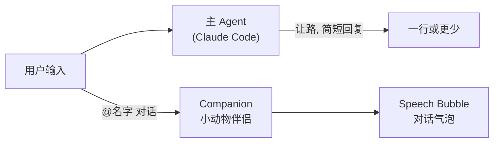
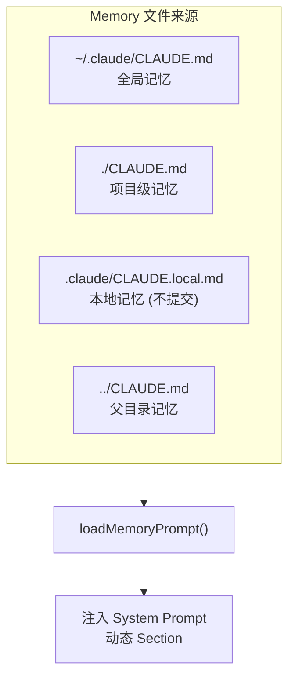

# 08 - 伴侣系统与辅助 Prompt

> 本文档包含 Companion (伴侣) 系统、Hooks 指令、Language 设置、XML Tag 体系等辅助 Prompt。

---

## 1. Companion / Buddy 系统

**源文件**: `buddy/prompt.ts`

### 1.1 工作原理



### 1.2 Prompt 内容

```
# Companion

A small {species} named {name} sits beside the user's input box and occasionally
comments in a speech bubble. You're not {name} — it's a separate watcher.

When the user addresses {name} directly (by name), its bubble will answer. Your
job in that moment is to stay out of the way: respond in ONE line or less, or just
answer any part of the message meant for you. Don't explain that you're not {name}
— they know. Don't narrate what {name} might say — the bubble handles that.
```

> Companion 是一个装饰性伴侣角色，显示在用户输入框旁边，会偶尔以对话气泡形式发表评论。
> 当用户直接对伴侣说话时，主 Agent 需要"让路"，只给出最简短的回复。

---

## 2. Hooks 系统指令

### 2.1 Hooks 概念

Hooks 是用户配置的 shell 命令，在特定事件发生时自动执行。比如:
- 工具调用前/后
- 用户提交 prompt 时
- 消息发送时

### 2.2 Prompt 中的 Hooks 规则

```
Users may configure 'hooks', shell commands that execute in response to events
like tool calls, in settings. Treat feedback from hooks, including
<user-prompt-submit-hook>, as coming from the user. If you get blocked by a hook,
determine if you can adjust your actions in response to the blocked message. If
not, ask the user to check their hooks configuration.
```

---

## 3. Language 语言设置

### 3.1 Prompt 内容

```
# Language
Always respond in {languagePreference}. Use {languagePreference} for all
explanations, comments, and communications with the user. Technical terms and
code identifiers should remain in their original form.
```

> 当用户设置了语言偏好时 (如中文、日文)，此 section 会被动态注入到 System Prompt 中。

---

## 4. XML Tag 体系

**源文件**: `constants/xml.ts`

Claude Code 使用大量 XML 标签来标记不同类型的消息内容:

### 4.1 命令/技能标签

| 标签名 | 用途 |
|--------|------|
| `<command-name>` | 技能/命令的名称标识 |
| `<command-message>` | 命令消息内容 |
| `<command-args>` | 命令参数 |

### 4.2 终端 I/O 标签

| 标签名 | 用途 |
|--------|------|
| `<bash-input>` | Bash 命令输入 |
| `<bash-stdout>` | Bash 标准输出 |
| `<bash-stderr>` | Bash 标准错误 |
| `<local-command-stdout>` | 本地命令标准输出 |
| `<local-command-stderr>` | 本地命令标准错误 |
| `<local-command-caveat>` | 本地命令注意事项 |

> 这些标签用来标识消息是终端输出，不是用户的实际输入。

### 4.3 生命周期标签

| 标签名 | 用途 |
|--------|------|
| `<tick>` | 自动唤醒心跳 (Proactive 模式) |
| `<system-reminder>` | 系统提醒信息 |

### 4.4 任务通知标签

| 标签名 | 用途 |
|--------|------|
| `<task-notification>` | 后台任务完成通知 |
| `<task-id>` | 任务 ID |
| `<tool-use-id>` | 工具调用 ID |
| `<task-type>` | 任务类型 |
| `<output-file>` | 输出文件路径 |
| `<status>` | 任务状态 (completed/failed/killed) |
| `<summary>` | 任务摘要 |
| `<reason>` | 失败原因 |

### 4.5 Worktree 标签

| 标签名 | 用途 |
|--------|------|
| `<worktree>` | Worktree 标识 |
| `<worktreePath>` | Worktree 路径 |
| `<worktreeBranch>` | Worktree 分支名 |

### 4.6 协作/通信标签

| 标签名 | 用途 |
|--------|------|
| `<teammate-message>` | 团队成员间消息 (Swarm) |
| `<channel-message>` | 外部频道消息 |
| `<channel>` | 频道名称 |
| `<cross-session-message>` | 跨会话 UDS 消息 |

### 4.7 Fork 标签

| 标签名 | 用途 |
|--------|------|
| `<fork-boilerplate>` | Fork 子线程的初始化提示包装 |

```
Fork Directive Prefix: "Your directive: "
```

### 4.8 Review 标签

| 标签名 | 用途 |
|--------|------|
| `<ultraplan>` | Ultraplan 模式 (远程并行规划) |
| `<remote-review>` | 远程 /review 结果 |
| `<remote-review-progress>` | 远程 review 心跳进度 |

---

## 5. TodoWrite / Task 管理

**工具名**: `TodoWrite`

> TodoWrite 工具用于管理任务列表，帮助 Claude 规划和跟踪工作进度。

System Prompt 中的指导:

```
Break down and manage your work with the TodoWrite tool. These tools are helpful
for planning your work and helping the user track your progress. Mark each task
as completed as soon as you are done with the task. Do not batch up multiple
tasks before marking them as completed.
```

---

## 6. Summarize Tool Results

```
When working with tool results, write down any important information you might
need later in your response, as the original tool result may be cleared later.
```

> 这条规则确保 Claude 在工具结果被自动清理前，先把重要信息记录在文本响应中。

---

## 7. Memory / CLAUDE.md

Memory 是 Claude Code 的持久化知识模块，通过读取项目中的 `CLAUDE.md` 文件加载:



Memory 文件通常包含:
- 项目的构建/测试/部署命令
- 代码风格规范
- 架构决策记录
- 常用工作流

---

## 8. Help 指令

```
 - /help: Get help with using Claude Code
 - To give feedback, users should report issues or use /share
```

---

## 9. 快捷交互

```
 - The user can use the shorthand `! <command>` as a prompt to run a shell
   command with the Bash tool. For example, `! git log -n 5` will run
   `git log -n 5` through the Bash tool. Do not ask for confirmation for
   these commands.
```
