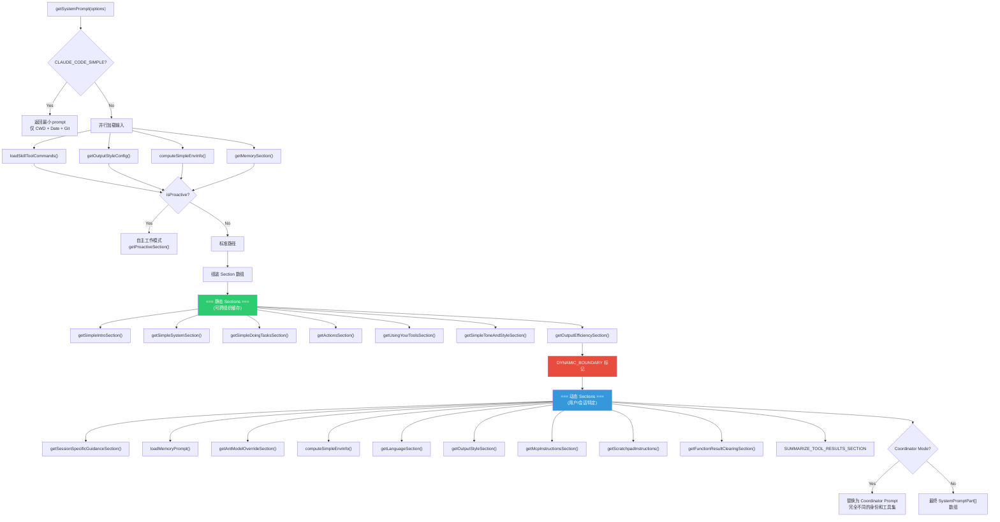
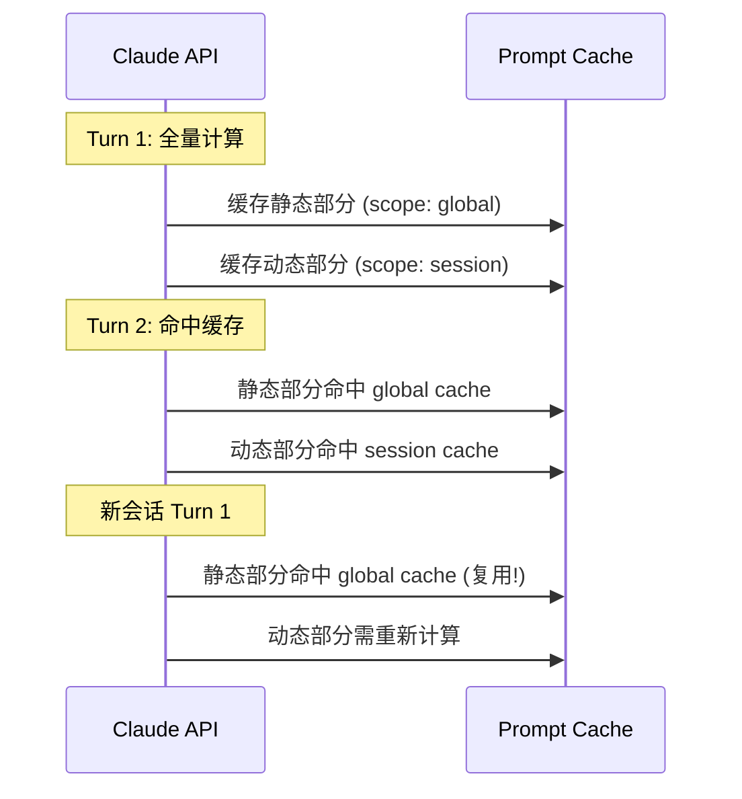
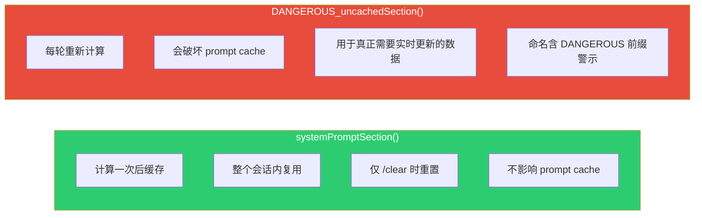
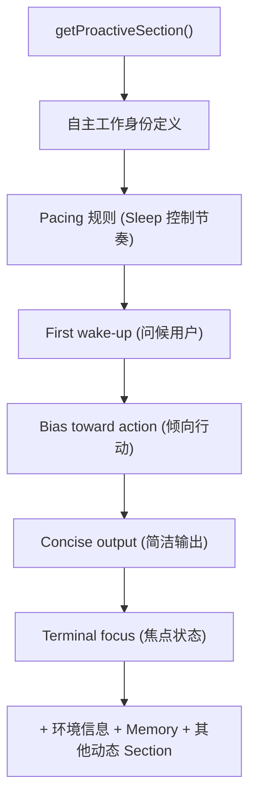
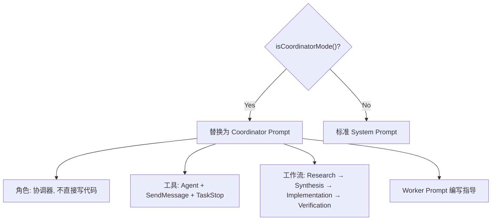

# 09 - Prompt 组装流程与缓存机制

> **源文件**: `constants/prompts.ts`, `constants/systemPromptSections.ts`
>
> 本文档详细解析 System Prompt 的完整组装流程、缓存边界设计和动态 Section 注册机制。

---

## 1. 组装总流程



---

## 2. 缓存边界 (DYNAMIC BOUNDARY)

### 2.1 为什么需要缓存边界

Claude API 支持 Prompt Caching，可以缓存 System Prompt 避免重复计算 token。但只有完全相同的前缀才能命中缓存。

System Prompt 被分为两部分:

| 区域 | 缓存范围 | 内容特征 |
|------|---------|---------|
| **标记前** (静态) | `scope: 'global'` — 跨组织/会话可复用 | 身份、规则、工具使用、风格等通用内容 |
| **标记后** (动态) | `scope: 'session'` — 仅当前会话 | 环境信息、Memory、语言偏好、MCP 指令等 |

### 2.2 标记格式

```
__SYSTEM_PROMPT_DYNAMIC_BOUNDARY__
```

### 2.3 缓存效果



---

## 3. Section 注册机制

**源文件**: `constants/systemPromptSections.ts`

### 3.1 两种 Section 类型



### 3.2 核心 API

```typescript
// 缓存型: 计算一次后在会话内持续重用
systemPromptSection(key: string, compute: () => string | null): string | null

// 非缓存型: 每轮都重新计算 (谨慎使用)
DANGEROUS_uncachedSystemPromptSection(key: string, compute: () => string | null): string | null

// 清除所有缓存 (通常在 /clear 时调用)
clearCachedSystemPromptSections(): void
```

### 3.3 已知的动态 Section

| Section Key | 类型 | 说明 |
|-------------|------|------|
| `mcpInstructions` | 可选缓存/增量 | MCP 服务指令 |
| `memory` | 缓存 | CLAUDE.md 持久化记忆 |
| `envInfo` | 缓存 | 环境信息 |
| `language` | 缓存 | 语言偏好 |
| `outputStyle` | 缓存 | 输出风格 |
| `scratchpad` | 缓存 | 临时目录 |
| `sessionGuidance` | 缓存 | 会话特定指导 |
| `frc` | 缓存 | 函数结果清理 |

---

## 4. SystemPromptPart 结构

```typescript
interface SystemPromptPart {
  content: string          // prompt 文本内容
  scope: 'global' | 'session'  // 缓存范围
}
```

组装完成后返回的是 `SystemPromptPart[]` 数组:

```
[
  { content: "Identity + System + ...", scope: "global" },   // 静态部分
  { content: "__DYNAMIC_BOUNDARY__",    scope: "global" },   // 边界标记
  { content: "Session guidance + ...",  scope: "session" },  // 动态部分
]
```

---

## 5. CLAUDE_CODE_SIMPLE 模式

当设置环境变量 `CLAUDE_CODE_SIMPLE=1` 时，返回极简 prompt:

```
# System

Environment:
- Working directory: {cwd}
- Today's date: {date}
- {isGit ? "This is a git repo" : "Not a git repo"}
```

> 这个模式用于极端精简场景，跳过所有复杂的 Section 组装。

---

## 6. Proactive 模式路径

当检测到 `isProactiveActivity` 时，走完全不同的 prompt 路径:



---

## 7. Coordinator 模式路径

当 `isCoordinatorMode()` 返回 `true` 时，**完全替换** 标准的 System Prompt:



Coordinator 模式同样会附加动态 Section (环境信息、MCP 指令等)，但核心身份和工具集完全不同。

---

## 8. 完整组装顺序表

| 序号 | Section | 函数/来源 | 缓存 Scope | 条件 |
|------|---------|-----------|-----------|------|
| 1 | Identity / Intro | `getSimpleIntroSection()` | global | 始终 |
| 2 | System | `getSimpleSystemSection()` | global | 始终 |
| 3 | Doing Tasks | `getSimpleDoingTasksSection()` | global | 始终 |
| 4 | Actions | `getActionsSection()` | global | 始终 |
| 5 | Using Tools | `getUsingYourToolsSection()` | global | 始终 |
| 6 | Tone and Style | `getSimpleToneAndStyleSection()` | global | 始终 |
| 7 | Output Efficiency | `getOutputEfficiencySection()` | global | 始终 |
| -- | **DYNAMIC BOUNDARY** | 标记 | -- | -- |
| 8 | Session Guidance | `getSessionSpecificGuidanceSection()` | session | 始终 |
| 9 | Memory | `loadMemoryPrompt()` | session | 有 CLAUDE.md 时 |
| 10 | Ant Model Override | `getAntModelOverrideSection()` | session | USER_TYPE=ant |
| 11 | Environment | `computeSimpleEnvInfo()` | session | 始终 |
| 12 | Language | `getLanguageSection()` | session | 有语言偏好时 |
| 13 | Output Style | `getOutputStyleSection()` | session | 有输出风格时 |
| 14 | MCP Instructions | `getMcpInstructionsSection()` | session | 有 MCP 服务时 |
| 15 | Scratchpad | `getScratchpadInstructions()` | session | 功能开启时 |
| 16 | Function Result Clearing | `getFunctionResultClearingSection()` | session | 始终 |
| 17 | Summarize Tool Results | `SUMMARIZE_TOOL_RESULTS_SECTION` | session | 功能开启时 |
